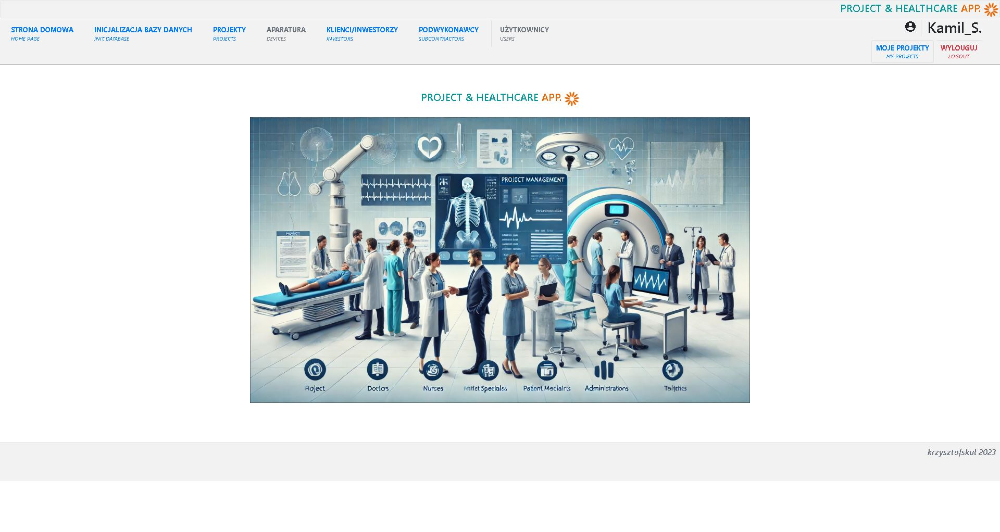
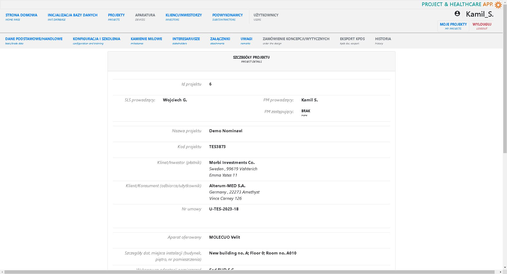
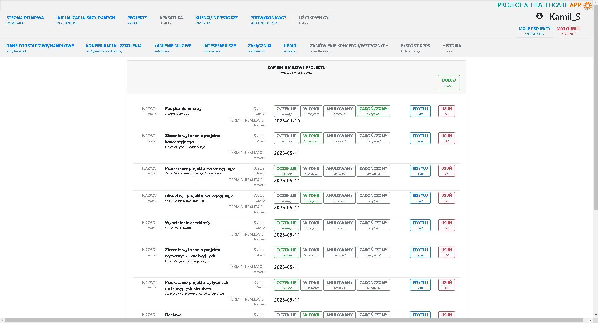

#### INTRODUCTION

SMNSH2 is a SpringBoot version of the SMNSH application. "Inspired by real life project management challenges in the Hospital Technology industry. The main goal of the app is to accelerate procedures inside a team of project managers and designers. Additionally, the intention is to gather all information in one place and simplify the process of sharing data between departments". 

#### VERSION DESCRIPTION

Version **#0.3** has been created to test and demonstrate an idea of the project management application as well as consult a possibility to implement for usage across the team. Demo version for testing is deployed at railway.com: [https://smnsh2-production.up.railway.app](https://smnsh2-production.up.railway.app)

#### TECHNOLOGY
* Java/SpringBoot
* SpringSecurity  
* MySQL/Hibernate  
* JavaScript/jQuery/Ajax  
* Thymelyeaf/Bootstrap
* OpenAI/ChatGPT  

#### PROJECT STATUS AND TODO'S

**Project status:** *in progress*  

**TODO:**  

* ~update a functionality setting a project data status using js modules on project data edit page~ (DONE)  
* ~create edit milestone functionality~ (DONE)   
    * ~update new milestone functionality~ (DONE)  

VER. 0.3-RC2:  
* new milestone and milestones in new projects without deadline set?  
* add user_guest as a project manager when create new project  
* create start page for logged user  
    * my projects button  
    * my profile button  
    * page for no projects yet  
* set demo projects for user guest  

VER. 0.4-ALPHA:  
* create validation  
* sort milestones?  
* add new customer while creating new project?  
* update init data functionality:  
     * essential data  
     * test/demo data  

#### SCREENSHOTS

**HOME PAGE**  
   
**PROJECT DETAILS PAGE**  
   
**PROJECT MILESTONES PAGE**  
   

#### CONTACT

*krzysztofskul@protonmail.com*